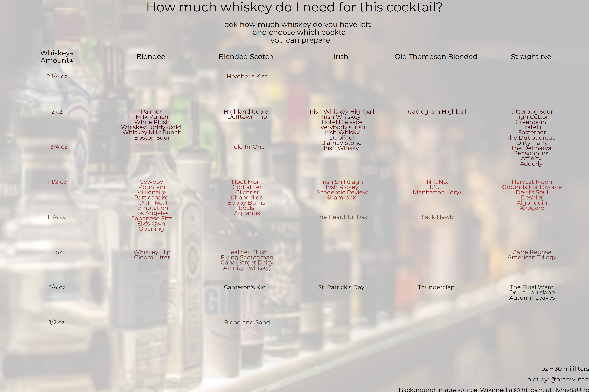

```{r}
library(tidyverse)
library(extrafont)
library(magick)
library(cowplot)
library(wesanderson)
loadfonts(device = "win")

boston_cocktails <- readr::read_csv('https://raw.githubusercontent.com/rfordatascience/tidytuesday/master/data/2020/2020-05-26/boston_cocktails.csv')

# Get 6 types of whiskey
whiskeys <- boston_cocktails %>% 
  filter(str_detect(measure, "oz")) %>% 
  filter(str_detect(ingredient, pattern = "Whiskey|whiskey")) %>% 
  group_by(ingredient) %>% 
  count() %>% 
  filter(n>5 & n<38) 
whiskeys <- whiskeys$ingredient

# Fix the "measure" column to get a continous value (convert from fraction to decimal)
for_plot <- boston_cocktails %>% 
  filter(ingredient %in% whiskeys) %>% 
  mutate(quantity=str_replace(measure, "oz", ""),
         quantity=str_trim(quantity, side = "right"),
         quantity=str_replace(quantity, " ", "+"))

for_plot$quantity <-  map_dbl(for_plot$quantity, ~eval(parse(text = .x)))

niveles <- levels(as.factor(for_plot$measure))
cantidad <- as.numeric(levels(as.factor(for_plot$quantity)))

# Some cocktails are repeated, I delete those for simplification
for_plot <-   for_plot[!duplicated(for_plot["name"]),]


for_plot2 <- for_plot %>% 
  mutate(name=str_replace(name, "cocktail|Cocktail", "")) %>% 
  group_by(ingredient, measure) %>% 
  mutate(t_n=row_number()) %>% #This is important! Get the number of names by ingredient and 
                               # measure, it will be used for "repeling" labels in ggplot text
  ungroup() %>% 
  select(name, ingredient, measure, quantity, t_n)

for_plot2$ingredient <- str_remove(for_plot2$ingredient, "Whiskey|whiskey")
ingredientes_levels <-  levels(as.factor(for_plot2$ingredient))

plot_w <- for_plot2 %>% 
  ggplot(aes(x = ingredient, y = (quantity-t_n/27)+1/27, label = name, color = measure))+
  geom_text(show.legend = TRUE, family = "Montserrat", size = 4.5)+
  geom_text(aes(x = 1, y = quantity, label = measure), check_overlap = TRUE,
            family = "Montserrat", size=4.5) +
  theme_void()+
  scale_x_discrete(limits=c(0, ingredientes_levels), position = "top", labels = c("Whiskey→\nAmount↓", ingredientes_levels))+
  scale_y_continuous(limits = c(0.3,2.25))+
  scale_color_manual(values=wes_palette(name = "BottleRocket1", n = 8, type = "continuous"))+
  labs(title = "How much whiskey do I need for this cocktail?",
       subtitle = "\n Look how much whiskey do you have left
       and choose which cocktail
       you can prepare \n",
       caption = "1 oz ~ 30 mililiters\nplot by: @oranwutan\nBackground image source: Wikimedia @ https://cutt.ly/nySaUBc")+
  theme(text = element_text(family = "Montserrat"),
        legend.position = "NA", 
        axis.text.x.top = element_text(color="black", family = "Montserrat" ),
        plot.title = element_text(size = 28, hjust=0.5),
        plot.subtitle = element_text(size = 16, hjust=0.5),
        plot.caption.position =  "plot",
        plot.caption = element_text(size = 13, lineheight = 1.5, vjust = 0),
        axis.text.x = element_text(size = 15))

img <-image_read(path ="https://upload.wikimedia.org/wikipedia/commons/0/0b/Backbar_with_various_bottles.jpg") %>%
  image_resize("360x330") %>%
  image_colorize(75, "white")
  
ggdraw()+
  draw_image(img)+
  draw_plot(plot_w)+
  ggsave2("2020_5_25_cocktails/cocktails.png", type = "cairo-png", height = 12, width = 18)

# NOTE that image won't be correctly rendered in rstudio viewer, open the saved file instead.
```
