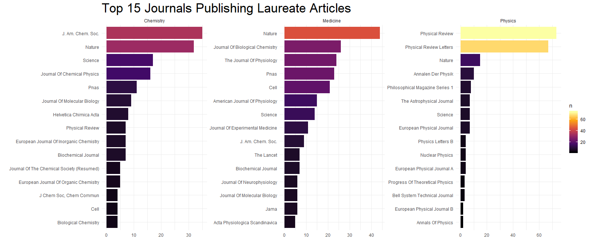

## Welcome to my Tidytuesdays page.  

Here are some of my plots and the corresponding code used to make them:

-  [Volcanoes](https://github.com/oranwutang/tidytuesdays_p/blob/master/12_may_2020_Volcanoes/volcanoes.MD)

-  [Nobel Prizes](https://github.com/oranwutang/tidytuesdays_p/tree/master/14-5-2019)

-  [Women in Research](https://github.com/oranwutang/tidytuesdays_p/blob/master/16-4-19/16-4-19%20banderas.R)

 

 
-  [Anime's ratings](https://github.com/oranwutang/tidytuesdays_p/blob/master/April%2023%202019/anime.R)

-  [Birds collisions](https://github.com/oranwutang/tidytuesdays_p/blob/master/April%2029%202019%20Birds/birds.R)

-  [Student/Teacher Ratios by Countries](https://github.com/oranwutang/tidytuesdays_p/blob/master/May%206%202019/Students_Teachers.R)

