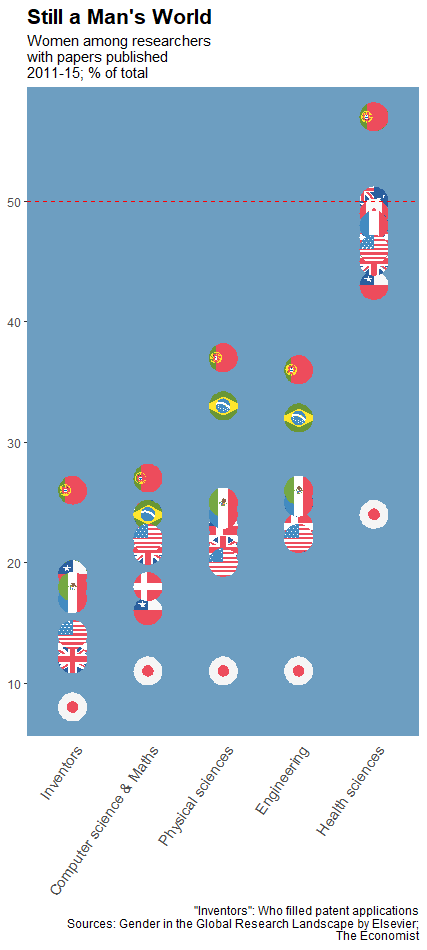
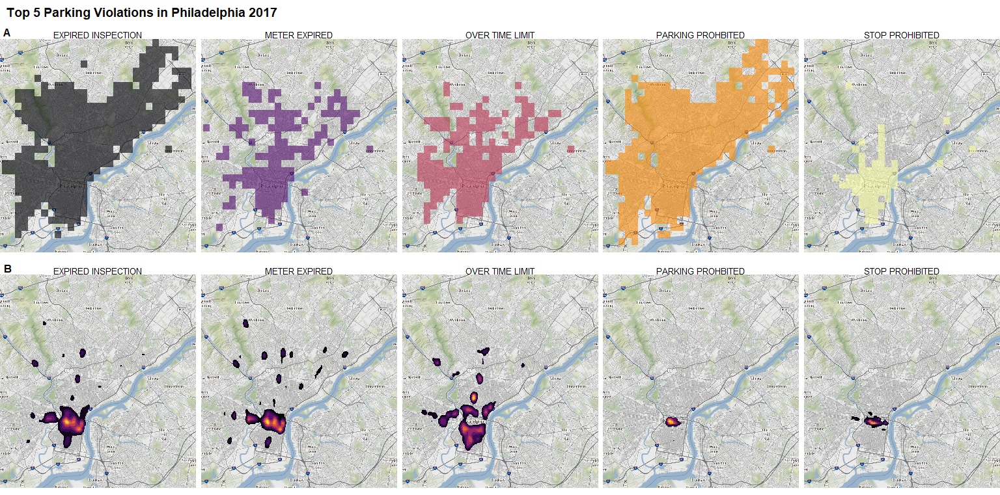
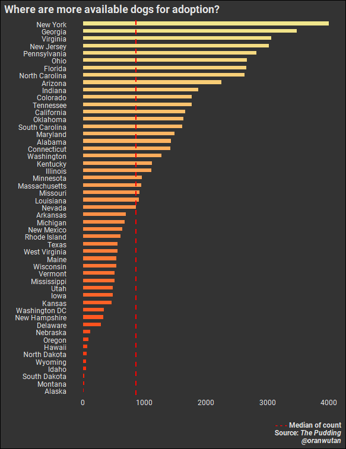
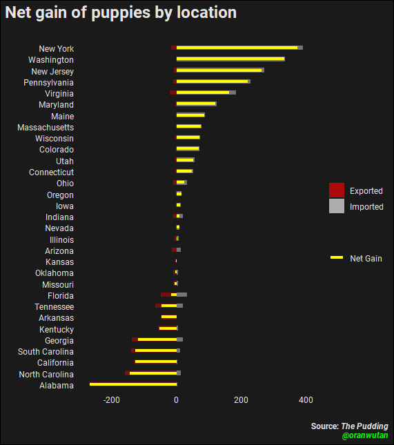
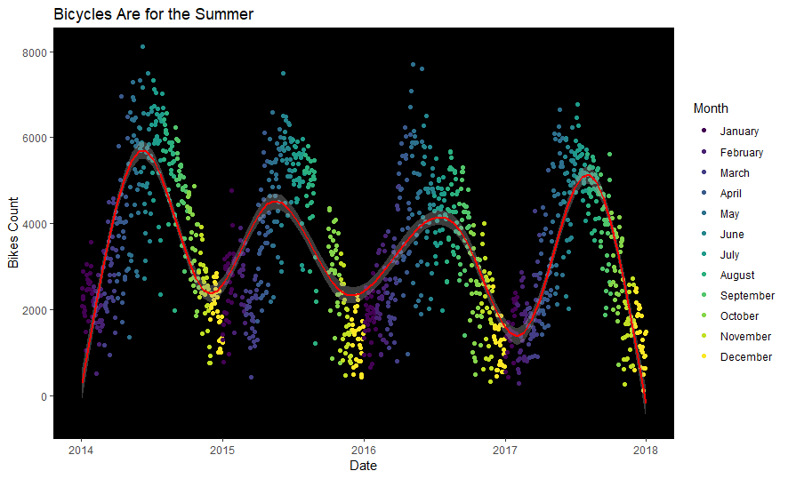

## My Tidytuesdays page.  

[Tidytuesdays](https://github.com/rfordatascience/tidytuesday) is a project intended to encourage people to use the [R](https://www.r-project.org/) programming language for data analysis and data visualization. It is maintained by [Thomas Mock](https://github.com/jthomasmock), each monday he publishes in [R4DS's github](https://github.com/rfordatascience/tidytuesday) or his [twitter](https://twitter.com/thomas_mock) account a dataset and participants analyse it and make some visualizations with it. People with any level of coding skills are welcomed to participate and contribute publishing the plots they made (preferably with the code) on twitter with the hashtag [#TidyTuesday](https://twitter.com/search?q=%23TidyTuesday&src=typeahead_click)

And who wins? What's the prize?
Nobody! There's no prize besides, maybe, some likes or retweets for your posts.
Seriously, the greatest reward for participating in tidytuesdays is the fun that you'll have making your data visualizations and watching the plots made by others, which frequently are great!

Here are some of my contributions to the tidytuesdays and the corresponding code used to create them:

-  [Volcanoes](https://github.com/oranwutang/tidytuesdays_p/blob/master/12_may_2020_Volcanoes/volcanoes.MD)

-  [Nobel Prizes](https://github.com/oranwutang/tidytuesdays_p/tree/master/14-5-2019)

-  [Women in Research](https://github.com/oranwutang/tidytuesdays_p/blob/master/16-4-19/16-4-19%20banderas.R)

 

 
-  [Anime's ratings](https://github.com/oranwutang/tidytuesdays_p/blob/master/April%2023%202019/anime.R)

-  [Birds collisions](https://github.com/oranwutang/tidytuesdays_p/blob/master/April%2029%202019%20Birds/birds.R)

-  [Student/Teacher Ratios by Countries](https://github.com/oranwutang/tidytuesdays_p/blob/master/May%206%202019/Students_Teachers.R)

-  [Parking violations (Philadelphia)](https://github.com/oranwutang/tidytuesdays_p/blob/master/Parking/ParkingViolations.R)

-  [Dogs adoptions](https://github.com/oranwutang/tidytuesdays_p/blob/master/dogsAdoptions/Dogs_16_12_2019.R)

-  [Bicycles](https://github.com/oranwutang/tidytuesdays_p/blob/master/Apr-02-2019/bycicles.R)

